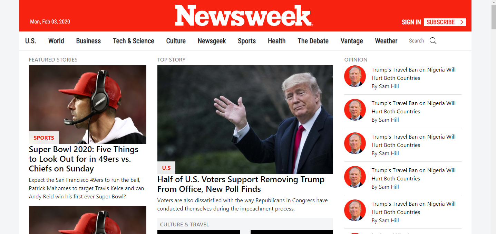
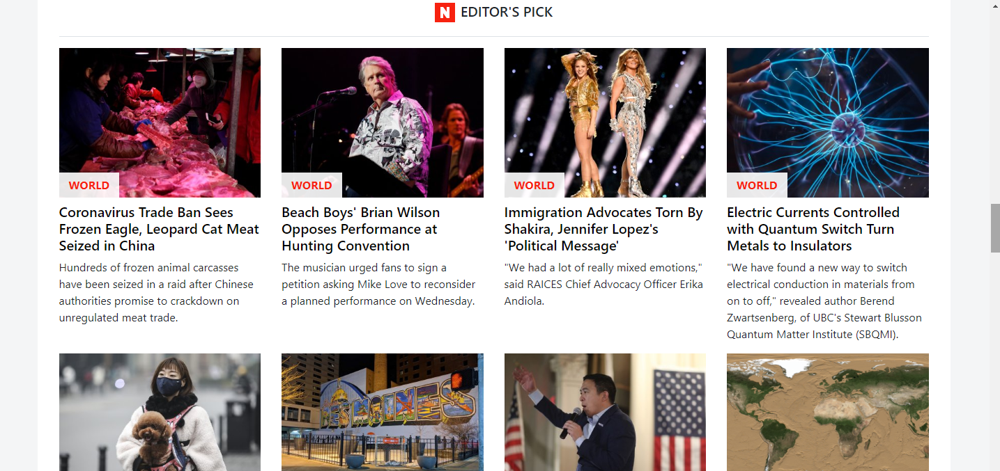

# Using-Bootstrap
This is the 7th project of the Microverse HTML and CSS Curriculum. For this project we are required to make a clone of the newsweek website, original site can be found [here](https://www.newsweek.com/)

## Screenshots

## Live Demo
[View the website here](https://rawcdn.githack.com/Blasco9/Using-Bootstrap/8dfbffbefb83d7a2826da792614ba8400699cdf8/index.html)

## Built with
- Bootstrap 4
- HTML5
- CSS3

## Author
This project was created by me [Blasco9](https://github.com/Blasco9)
